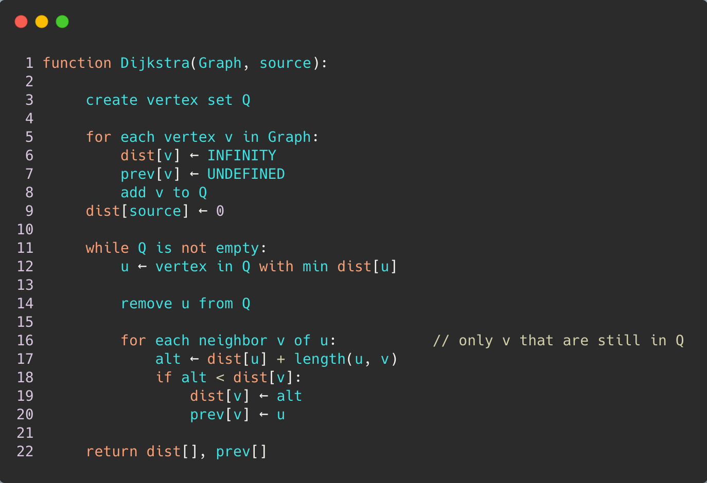

# NetHack-2021

# AIM
Designing an agent which can navigate the procedurally generated, ascii dungeons of Nethack  :trophy: 

### Todos (Feel free to add if you feel anything is missing):heavy_plus_sign:	

- [ ] Develop a policy that favors the agent almost all the time.
- [ ] Model based vs Model free, battle for best
- [ ] Mix N Match different policies
- [ ] Make three independent agents where the third is a mix of the two.
- [ ] If using NN, optimize it using Neural Magic - Reduces inference time
- [ ] Maybe use stable baselines

### In Progress :pick:	

- Working on creating a player using path finding algorithms (SSSP, ASSP etc) :boom:

### Done :heavy_check_mark:	
	
* Not done
### Gotchas

- Figure out how to deal with secret passage :black_small_square: :small_red_triangle_down:	

### Algorithms (Add picture)
Using
   

### Testings
- Add tests